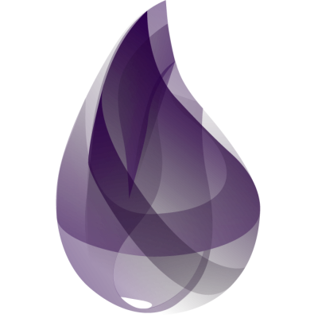
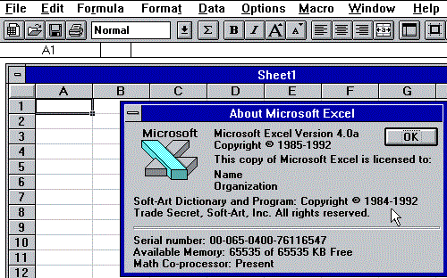
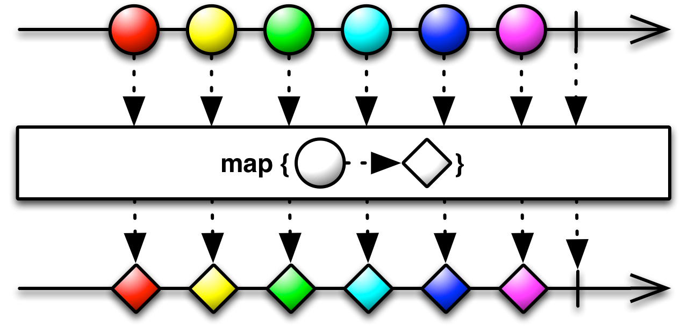
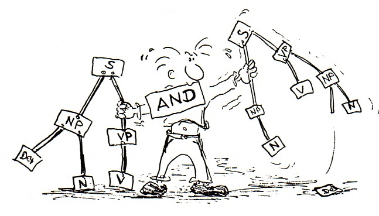
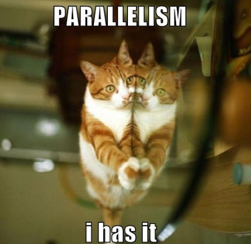

#HSLIDE
## Защо Elixir?
(в контекста на реактивното програмиране и реактивните системи)

#HSLIDE
## Съдържание

0. Представяне
1. Какво е 'Reactive Programming'?
2. Какво е Elixir?
3. Elixir-level процеси
4. Flow & GenStage
5. Обществото около Elixir

#HSLIDE


#HSLIDE
### Кой съм аз?

* Аз съм Николай/Meddle. <!-- .element: class="fragment" -->
* Аз съм баща. <!-- .element: class="fragment" -->
* Аз съм developer и работя в транспорта. <!-- .element: class="fragment" -->
* Аз съм мързелив. <!-- .element: class="fragment" -->
* Аз съм част от 'elixir-lang.bg' <!-- .element: class="fragment" -->

#HSLIDE
### Кой съм аз?


#HSLIDE
### Кой съм аз?

* Обичам нещата да стават лесно и автоматизирано. <!-- .element: class="fragment" -->
* Обичам функционалното програмиране. <!-- .element: class="fragment" -->
* Обичам Elixir. <!-- .element: class="fragment" -->

#HSLIDE
### Кои сте вие?

* Вие се интересувате от програми, изградени от компоненти? <!-- .element: class="fragment" -->
* Вие се интересувате от програми, които използват всички налични ресурси? <!-- .element: class="fragment" -->
* Вие искате състоянието на данните ви и състоянието на програмата ви да са свързани и тази връзка да е автоматизирана? <!-- .element: class="fragment" -->

#HSLIDE


#HSLIDE
### Кои сте вие?

* Или пък сте чували за Elixir? <!-- .element: class="fragment" -->
* Или пък сте HYPE-нати от думичката 'Reactive'? <!-- .element: class="fragment" -->
* Или пък искате да се видим, защото се познаваме! <!-- .element: class="fragment" -->

#HSLIDE


#HSLIDE
### Какво е 'Reactive Programming'?


#HSLIDE
### Какво е 'Reactive'?

* Терминът е малко размит... <!-- .element: class="fragment" -->
* Свързва се с думи като 'streaming', 'lightweight', 'real-time', 'asynchronous' <!-- .element: class="fragment" -->
* И още с 'events', 'messages', 'notifications', 'components' <!-- .element: class="fragment" -->

#HSLIDE
### Какво е 'Reactive'?

* Една програма е реактивна, когато различни компоненти от нея могат да реагират на промени <!-- .element: class="fragment" -->
 * от други компоненти, от които се интересуват <!-- .element: class="fragment" -->
 * от външни източници, от които се интересуват <!-- .element: class="fragment" -->
 * на данните, които използват <!-- .element: class="fragment" -->

#HSLIDE


#HSLIDE
### Какво е 'Reactive Programming'?

* Начин да напишем реактивна програма. <!-- .element: class="fragment" -->
* Често е 'event-driven'. <!-- .element: class="fragment" -->
* Често е декларативно. <!-- .element: class="fragment" -->
* Върти се около промени в данните и последствията от това. <!-- .element: class="fragment" -->

#HSLIDE
### Какво е 'Reactive Programming'?

Терминът FRP е много размит:

#HSLIDE
### Какво е 'Reactive Programming'?

* В Haskell средите се говори за променливи, знаещи миналите си и настоящите си стойности - поведения <!-- .element: class="fragment" -->
* В RX средите се говори за 'Observables' - потоци, които 'push'-ват информация при промяна <!-- .element: class="fragment" -->
* Някои хора виждат map/filter/accumulate и за тях това значи FRP <!-- .element: class="fragment" -->

#HSLIDE
### Какво е 'Reactive Programming'?
Затова няма да говорим за FRP.

#HSLIDE
### Какво е 'Reactive Programming'?

* Обикновено има библиотеки, които ни позволяват да описваме зависимости между компоненти. <!-- .element: class="fragment" -->
* Такива библиотеки се справят с промени в данните, използвайки тези зависимости. <!-- .element: class="fragment" -->
* Асинхронна комуникация, event-и, конкурентни update-и <!-- .element: class="fragment" -->

#HSLIDE
### Meddle and The Reactive Programming


#HSLIDE
### Meddle and The Reactive Programming

* В езици, с които съм работил сериозно - Java, Ruby, JavaScript съм се чувствал ограничен или затруднен. <!-- .element: class="fragment" -->
* Поради това съм използвал/разработвал различни библиотеки, които често са били 'Реактивни'. <!-- .element: class="fragment" -->
* Аз съм мързелив - искам да си улесня живота, искам програмите ми да се адаптират сами към промени в данните. <!-- .element: class="fragment" -->

#HSLIDE
### Meddle and The Reactive Programming : Prolib

* Java - имаме обекти. <!-- .element: class="fragment" -->
* Искаме когато се промени поленце на обект, други заинтересовани поленца да се променят. <!-- .element: class="fragment" -->
* Искаме това да е 'мързеливо' : стойности се пресмятат само при поискване. <!-- .element: class="fragment" -->
* GUI! <!-- .element: class="fragment" -->

#HSLIDE

```java
class AreaComputation extends BaseProObject {
  RwProp<Integer> width() {
    return getBean().makeValueProp("width", Integer.class);
  }
  RwProp<Integer> height() {
    return getBean().makeValueProp("height", Integer.class);
  }
  Prop<Integer> area() {
    class area extends AutoProperty<Integer> {
      protected Integer compute() {
        return width().get() * height().get();
      }
    }
    return getBean().makeProp(area.class);
  }
}
```

#HSLIDE

```java
  public static void main(String[] args) {
    AreaComputation areaComputation = new AreaComputation();

    areaComputation.width().set(6);
    areaComputation.height().set(8);

    System.out.println(areaComputation.area().get());
    // 48
  }
```

#HSLIDE
### Meddle and The Reactive Programming : RxJava


#HSLIDE
### Meddle and The Reactive Programming : RxJava

* Java - имаме обекти. <!-- .element: class="fragment" -->
* Observer pattern, работещ за потоци от данни, даже безкрайни <!-- .element: class="fragment" -->
* Справя се с грешки! <!-- .element: class="fragment" -->
* Лесна работа с конкурентна логика в Java!!! <!-- .element: class="fragment" -->

#HSLIDE
### Meddle and The Reactive Programming : ProAct.js


#HSLIDE
### Meddle and The Reactive Programming : ProAct.js

* JavaScript - имаме неща. <!-- .element: class="fragment" -->
* Имаме и browser - понякога. <!-- .element: class="fragment" -->
* Пишем Prolib за browser! <!-- .element: class="fragment" -->
* Добавяме и реактивни потоци! <!-- .element: class="fragment" -->
* Оксиморони навсякъде!!! <!-- .element: class="fragment" -->

#HSLIDE

```javascript
var obj = ProAct.prob({
  a: 4,
  b: 3,
  sum: function () {
    return this.a + this.b;
  }
});
```

#HSLIDE

```javascript
console.log(typeof(obj.sum)); // "number"
console.log(obj.sum); // sum is simple field now and it is 7

obj.a = 5;
console.log(obj.sum); // sum is 8
obj.b = 25;
console.log(obj.sum); // sum is 30
```

#HSLIDE
### Meddle and The Reactive Programming : Reacto

* Ruby - имаме блокове! <!-- .element: class="fragment" -->
* RX the Ruby way! <!-- .element: class="fragment" -->
* Много по-приятно писане на код - поне за мен. <!-- .element: class="fragment" -->

#HSLIDE

```ruby
results = Reacto::HTTP.get('http://www.some-url.com')
  .map { |value| Nokogiri::HTML(value) }
  .map { |value| value.css('div.pageing') }
  .map(&:children)
  .map(&:first)
  .map(&:text)
  .map(&:strip)
  .map(&:flatten).map(&:first).map(&:to_i)
  .map { |value| (value / 10) + 1 }
  .flat_map do |value|
    Reacto::Trackable.interval(5, (0..value).each)
  end
....
```

#HSLIDE

```ruby
subscription = results.on(
  value: consumer,
  error: ->(e) { raise e },
  close: ->() { p 'Done' }
)
results.await(subscription)
```

#HSLIDE
### Какво получаваме?

* Лесно използване на всички налични ресурси - multiple cores, multiple CPUs. <!-- .element: class="fragment" -->
* Лесен начин за разделяне на програмата на компоненти. <!-- .element: class="fragment" -->
* Рецепти за справяне и самолекуване от грешки. <!-- .element: class="fragment" -->
* Улеснява работата с асинхронен код и non-blocking IO. <!-- .element: class="fragment" -->
* В много случаи ни помага да напишем нещо по начин, лесен за поддръжка. <!-- .element: class="fragment" -->

#HSLIDE
### Какво получаваме?

* В езици като JAVA, JavaScript и Ruby този начин на програмиране често е 'the right way' за мен. <!-- .element: class="fragment" -->
* Разделяме си програмата/проблема на малки части и декларативно описваме как зависят една от друга. <!-- .element: class="fragment" -->
* Проблемът ще бъде решен използвайки това описание, програмата ще се адаптира към промени в данните! <!-- .element: class="fragment" -->


#HSLIDE
#### И тогава открих Elixir...


#HSLIDE
### Какво е Elixir?

* Функционален език за програмиране. <!-- .element: class="fragment" -->
* Върви на BEAM - Виртуална машина на Erlang. <!-- .element: class="fragment" -->
* Всичко написано на Erlang може да се ползва в Elixir. <!-- .element: class="fragment" -->
* Млад език - 2012-2013, създателят му идва от Ruby света. <!-- .element: class="fragment" -->

#HSLIDE
### Какво е Elixir?

* Конкурентно-ориентиран език за програмиране. <!-- .element: class="fragment" -->
* Идеален за разработка на fault-tolerant системи. <!-- .element: class="fragment" -->
* Идеален за разработка на дистрибутирани системи. <!-- .element: class="fragment" -->
* Не е 'език за реактивно програмиране'. <!-- .element: class="fragment" -->
* Идеален за писане на реактивни системи/програми! <!-- .element: class="fragment" -->

#HSLIDE
Elixir е език изграден от 4 слоя, като всеки от тях е надграждане на по-долните слоеве:

1. Функционален Elixir. <!-- .element: class="fragment" -->
2. Конкурентен Elixir - процеси и съобщения. <!-- .element: class="fragment" -->
3. Дистрибутиран Elixir - процеси и съобщения на различни VM или машини. <!-- .element: class="fragment" -->
4. Fault-tolerant Elixir - връзки между процеси, мониторинг, OTP. <!-- .element: class="fragment" -->

#HSLIDE
### Синтаксис


#HSLIDE
#### Анонимни функции:
* Това е функцията x<sup>2</sup>.

```elixir
fn (x) -> x * x end
```

#HSLIDE
#### Анонимни функции:
* Такава функция може да се извика така:

```elixir
(fn (x) -> x * x end).(3)
# -> 9
```

#HSLIDE
#### Анонимни функции:
* Може да се присвои на променлива:

```elixir
f = fn (x) -> x * x end
f.(3)
# -> 9
```

#HSLIDE
#### Типове:
* Променливите се дефинират без да се задава тип.
* Те си получават типа взависимост от стойността им.

#HSLIDE
#### Типове:

```elixir
5               # -> integer
0x53            # -> integer, the same as 83
5.5             # -> float
false           # -> boolean
:dalia          # -> atom
"elixir"        # -> string
[1, 2, 3]       # -> list
[a: 1, b: 2]    # -> keyword list
{1, 2}          # -> tuple
fn (x) -> x end # function
~r/\d+/         # regular expression
%{a: 1, b: 2}   # map
```

#HSLIDE
#### Pattern matching:
```elixir
4 = 4                 # Интерпретира се без грешка
5 = 4                 # Грешка - MatchError
a = 4                 # Няма грешка
4 = b                 # Грешка - променливата b не съществува.
4 = a                 # Успех - а съществува и стойносста ѝ е 4
{d, e, 5} = {7, 6, 5} # Успех, d става 7, e става 6
f = fn
  (5) -> {:ok, 5}
  (x) -> {:error, x}
end
{:ok, x} = f.(5)     # Успех, x получава стойност 5
{:ok, x} = f.(6)     # Грешка, резултатът е {:error, 6}
```

#HSLIDE
#### Модули:
Модулите са колекции от именовани функции.

```elixir
defmodule MyModule do
  def square(x) do
    x * x
  end
end
```

#HSLIDE
## Elixir-level процеси


#HSLIDE
#### Процеси:
* Не става дума за OS-ниво процеси. <!-- .element: class="fragment" -->
* Всичко написано на Elixir се изпълнява в процеси. <!-- .element: class="fragment" -->
* Те са изолирани един от друг. <!-- .element: class="fragment" -->
* Много леки откъм ресурси (CPU/RAM). <!-- .element: class="fragment" -->
* Mогат да бъдат хиляди без да натоварват машината на която вървят. <!-- .element: class="fragment" -->

#HSLIDE
#### Процеси:
Процесите в Elixir/Erlang се създават със `spawn`.

```elixir
# Тази функция ще се изпълни в нов процес:
pid = spawn fn -> 2 * 21 end

Process.alive?(pid)
# false, тъй като функцията се изпълнява бързо.

# Можем да ползваме pid-а на текущия процес с:
self()
Process.alive?(self()) # true
```

#HSLIDE
#### Процеси:

```elixir
pid = spawn(fn ->
  receive do
    {:howdy, message} -> IO.puts(message)
    {_, message} -> IO.puts("Няма значение")
  end
end)

send pid, {:howdy, "Как си?"}
```

#HSLIDE
#### Процеси + състояние:

```elixir
def main_loop(state) do
  new_state =
    receive do
      some_transforming_msg -> transform(state)
      anything_else -> state
    end

  main_loop(new_state)
end
```

#HSLIDE
### Elixir - the son of Erlang


#HSLIDE
### Erlang
* Erlang е създаден в лаборатория на Ericsson през 80-те години. <!-- .element: class="fragment" -->
* Основната му идея е да е способ за писане на конкурентни програми, които трябва да могат да се изпълняват безкрайно. <!-- .element: class="fragment" -->
* По-добър начин за писане на Телеком програми. <!-- .element: class="fragment" -->

#HSLIDE
### Телеком програми


#HSLIDE
### Телеком програми
* Конкурентни (едно устройство трябва да може да поддържа хиляди едновременни транзакции).
* Толерантни към грешки и проблеми, както софтуерни, така и хардуерни.  <!-- .element: class="fragment" -->
* Практически нулев downtime.  <!-- .element: class="fragment" -->
* Кодът им да може да се заменя с по-нови версии, докато те работят.  <!-- .element: class="fragment" -->

#HSLIDE
### Erlang!
1. Кодът върви в процеси, които са на ниво език.
2. Тези процеси не споделят памет - имат собствен стек и собствен heap. <!-- .element: class="fragment" -->
3. Много са лесни за създаване и си комуникират чрез размяна на съобщения.  <!-- .element: class="fragment" -->
4. Лесно могат да си комуникират помежду си, дори да са на различни машини. <!-- .element: class="fragment" -->
5. Ако един процес 'умре', другите продължават да живеят. Може нов да го замести, зависи от стратегията. <!-- .element: class="fragment" -->

#HSLIDE
### Erlang!


#HSLIDE
* Erlang не е повлиян от и не имплементира Actor модела.
* Процесите на Erlang и актьорите имат общ предшественик - комуникацията между обекти със съобщения.   <!-- .element: class="fragment" -->
* Доста от идеите за Актьорите намират своят път в процесите на Erlang независимо от Actor модела.  <!-- .element: class="fragment" -->
* Вътрешността на един процес няма нищо общо с Actor модела.  <!-- .element: class="fragment" -->

#HSLIDE
Joe Armstrong нарича Erlang език за конкурентно-ориентирано програмиране, като се базира на няколко правила.

#HSLIDE
* Системата е изградена от процеси.
* Процесите не споделят нищо.  <!-- .element: class="fragment" -->
* Процесите си комуникират чрез асинхронно изпращане на съобщения.  <!-- .element: class="fragment" -->
* Процесите са изолирани един от друг.  <!-- .element: class="fragment" -->

#HSLIDE
### Elixir!


#HSLIDE
Elixir е всичко, което е Erlang
* С мета-програмиране <!-- .element: class="fragment" -->
* С приятен синтаксис <!-- .element: class="fragment" -->
* С бурно-развиващо се общество <!-- .element: class="fragment" -->
* С множество библиотеки <!-- .element: class="fragment" -->

#HSLIDE
## Реактивни системи/програми с Elixir

#HSLIDE


#HSLIDE
* Elixir е elastic - поради процесите и това как работят техните Scheduler-и.
* Elixir е resilent - идеологията 'let it crash' и OTP. <!-- .element: class="fragment" -->
* Elixir е message driven. <!-- .element: class="fragment" -->

#HSLIDE
### Примери


#HSLIDE
#### Streams


#HSLIDE
```elixir
File.stream!("path/to/some/file")
|> Stream.flat_map(&String.split(&1, " "))
|> Enum.reduce(%{}, fn word, acc ->
  Map.update(acc, word, 1, & &1 + 1)
end)
|> Enum.to_list()
```

#HSLIDE
#### Tasks


#HSLIDE
```elixir
defmodule PEnum do
  def map(enumerable, func) do
    enumerable
    |> Enum.map(&(Task.async(fn -> func.(&1) end)))
    |> Enum.map(&Task.await/1)
  end
end
```

#HSLIDE
```elixir
defmodule Divisors do
  def calculate(number) do
    (2..(number - 1))
    |> Enum.filter(fn n -> rem(number, n) == 0 end)
    |> wrap_result(number)
  end

  defp wrap_result(list, number) do
    %{number => list}
  end
end
```

#HSLIDE
```elixir
Task.async_stream(2..10000, Divisors, :calculate, [])
|> Stream.map(fn {:ok, result} -> result end)
|> Enum.reduce(%{}, fn(curr, map) -> Map.merge(map, curr) end)
```

#HSLIDE
#### OTP & supervisors


#HSLIDE
```elixir
children = [
  supervisor(SomeSupervisor, []),
  worker(SomeServer, [args])
]

opts = [strategy: :one_for_all]

supervise(children, opts)
```

#HSLIDE
## Flow & GenStage


#HSLIDE
```elixir
File.stream!("path/to/some/file")
|> Flow.from_enumerable()
|> Flow.flat_map(&String.split(&1, " "))
|> Flow.partition()
|> Flow.reduce(fn -> %{} end, fn word, acc ->
  Map.update(acc, word, 1, & &1 + 1)
end)
|> Enum.to_list()
```

#HSLIDE
* GenStage добавя back-pressure механизми към потоците от данни
* Преизползване на код с GenServer & Supervisor. <!-- .element: class="fragment" -->
* Данни, модули, процеси! <!-- .element: class="fragment" -->

#HSLIDE
## Обществото около Elixir


#HSLIDE
* Езикът се развива бързо и е насочен към реактивност и конкурентност.
* Phoenix <!-- .element: class="fragment" -->
* Ecto <!-- .element: class="fragment" -->
* Flow, Tasks & GenStage <!-- .element: class="fragment" -->

#HSLIDE
* Erlang търпи голям бум поради Elixir
* Виртуалната машина става все по-добра. <!-- .element: class="fragment" -->
* Конференции и умни хора навсякъде! <!-- .element: class="fragment" -->

#HSLIDE
* Ние имаме курс във ФМИ!
* Имаме си общество - meetup! <!-- .element: class="fragment" -->
* Имаме си блог с материали! <!-- .element: class="fragment" -->
* Чакаме ви! <!-- .element: class="fragment" -->

#HSLIDE
## Край

